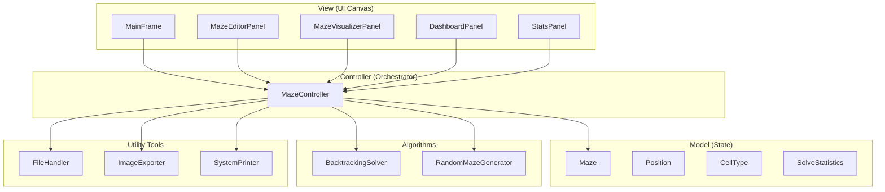
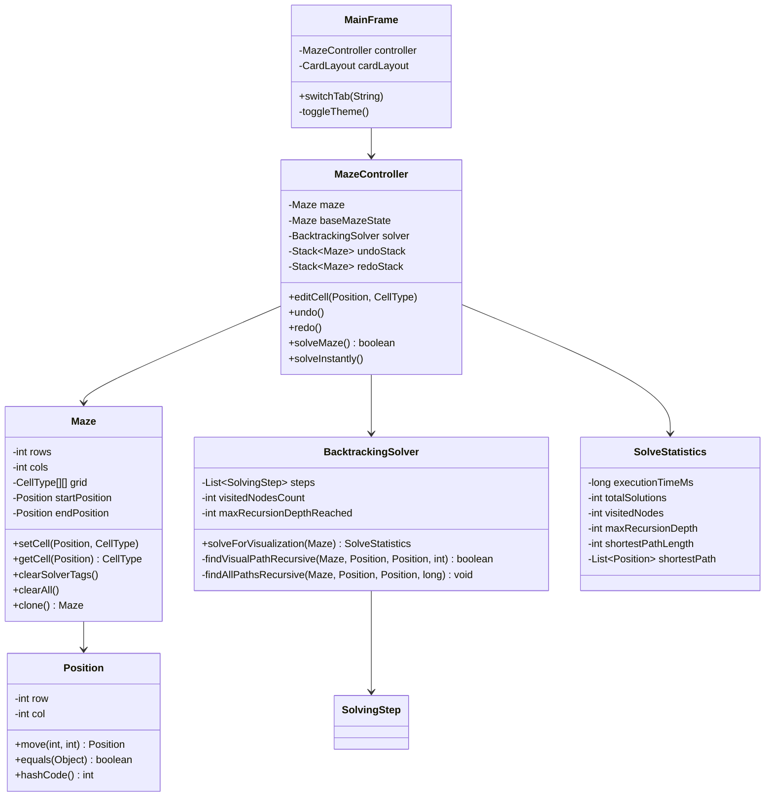
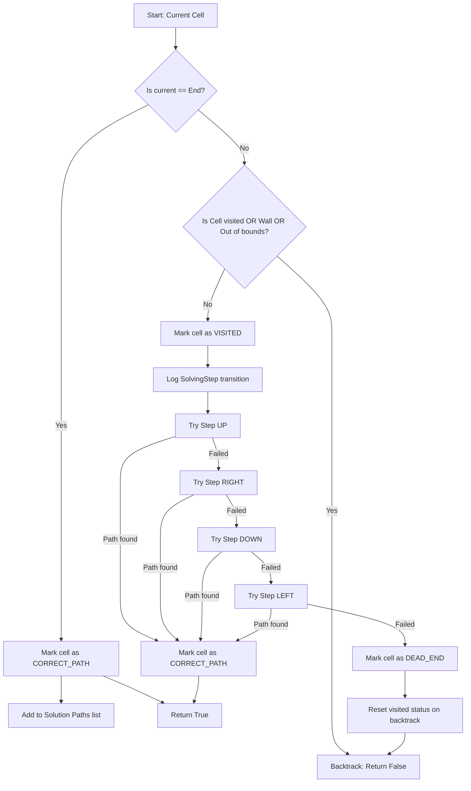
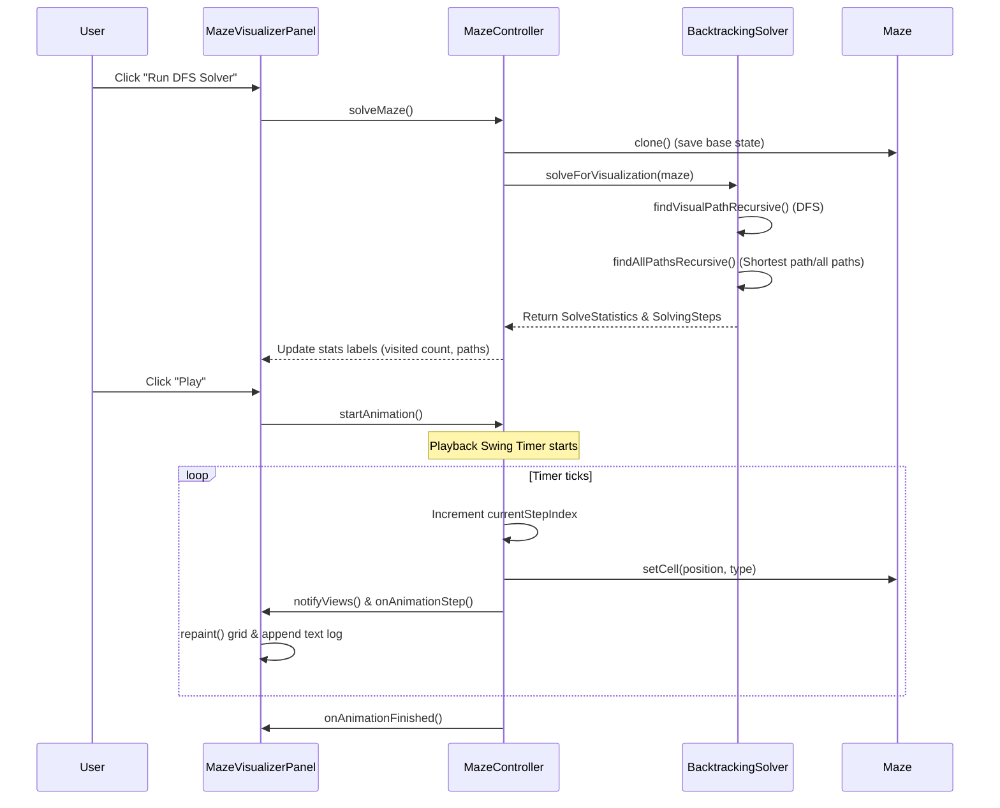

# MAZE SOLVER - PROJECT REPORT & DESIGN DOCUMENTATION

**Course/University Level Evaluation Project**  
**Core Technologies**: Java Swing, Java AWT, Object-Oriented Programming, Recursion, DFS, Backtracking.

---

## 1. Executive Summary

The **Maze Solver** is a premium desktop application engineered to demonstrate the principles of recursion, stack frames, and backtracking using Depth-First Search (DFS). It provides a full-featured graphical sandbox where users can design custom grids, execute visual step-by-step algorithms, track execution metrics, and print or export data. The user interface has been custom-styled with antialiasing, custom UI components, responsive layout cards, and dynamic Light/Dark modes to simulate modern desktop aesthetics.

---

## 2. System Architecture & Diagram Specifications

### 2.1 Architecture Diagram
The application follows a strict **Model-View-Controller (MVC)** structural pattern to divide state management, business rules, visual drawing, and input event bindings.



---

### 2.2 Class Diagram
The relationships between the core classes of the project:



---

### 2.3 Traversal Flowchart
The control flow chart of the recursive DFS backtracking solver algorithm:



---

### 2.4 Sequence Diagram
Interaction between components when the user starts the solver playback:



---

## 3. Algorithm Explanation & Complexity Analysis

### 3.1 Recursive DFS and Backtracking
The search algorithm starts at the `START` position and explores as deep as possible along each branch before backtracking. 

1.  **Exploration**: At the current cell `(r, c)`, the algorithm checks if it is the target `END` cell. If not, it marks the cell as visited to prevent cycles and recursively tries to step in four directions (Up, Right, Down, Left).
2.  **Backtracking**: If all four directions return `false` (meaning they hit walls, boundaries, or already-visited cells that do not lead to the end), the algorithm unmarks the cell (reverting visited state or marking as `DEAD_END`) and returns `false` to the caller. This pops the stack frame and reverts to the previous cell to try remaining directions.
3.  **Cycle Prevention**: Cycles are prevented by maintaining a 2D boolean grid `visited[rows][cols]`. A cell is flagged as `true` when entered and reset to `false` when fully backtracked.
4.  **Shortest Path Tracking**: To calculate the shortest path, a fast global search traverses *all* paths. Whenever `endPosition` is hit, the current path list is compared against the shortest path list, and replaced if shorter.

### 3.2 Complexity Analysis

| Metric | Depth-First Search (DFS) Backtracking |
| :--- | :--- |
| **Worst-Case Time Complexity** | $O(4^{V})$ or $O(4^{R \times C})$ (in an open grid with no walls where every cell has 4 choices) |
| **Average-Case Time Complexity** | $O(R \times C)$ (in ordinary maze corridors where branches are restricted) |
| **Space Complexity** | $O(R \times C)$ due to the recursion call stack and `visited` matrix |

*   **Best-Case**: The solver locates the solution immediately (e.g. straight line path from start to end) in $O(L)$ where $L$ is the path length.
*   **Worst-Case**: In a large open room without walls, the algorithm explores all dead-ends and combinations of loops, resulting in high recursion depth.

---

## 4. User Manual

### 4.1 Running the App
1.  Double-click `run.bat` (if created) or compile and run via command line:
    ```bash
    javac -d bin -sourcepath src src/Main.java
    java -cp bin Main
    ```
2.  The loading screen will play for 2.5 seconds, then display the Dashboard workspace.

### 4.2 Creating Custom Mazes
1.  Select **Maze Editor** from the left sidebar.
2.  Set the grid size using the dropdown (e.g., `21 x 21`).
3.  Click/drag the mouse left button to draw Walls.
4.  Switch the brush to "Erase Walls" to clear cells.
5.  Use "Set Start" and "Set End" to relocate the Blue and Red cells.
6.  Click **Save** to write the maze configuration into a `.maze` file, or click **Generate Perfect DFS** to automatically carve a maze.

### 4.3 Visualizing the Solution
1.  Navigate to **Solver Visualizer**.
2.  Click **Run DFS Solver**. This processes the statistics and builds the transition timeline.
3.  Press **Play** to watch the solver search the grid.
4.  Adjust the **Delay** slider to control playback speed.
5.  Use **Step Forward** and **Step Backward** buttons to review decision points.
6.  Click **Screenshot** to export the visual state to a PNG file, or click **Export Report** to save a text analysis.

---

## 5. Developer Manual

### 5.1 Architecture Overview
The application is structured into discrete packages under `src/`:
*   `model`: Contains grid states and coordinate data representation.
*   `controller`: Connects visual controls with state data and handles playback threads.
*   `algorithm`: Solves grids, tracks recursion depth, and generates layouts.
*   `view`: Builds UI frames, sidebar panels, layout switches, themes, and rounded components.
*   `utils`: Manages platform dialogs, custom file configurations, printing pipelines, and image writers.

### 5.2 Compiling & Class Paths
All code is native Core Java and uses standard libraries (`javax.swing`, `java.awt`, `java.io`, `java.print`). It does not require Maven, Gradle, or external dependencies. To compile and run on any operating system, use standard command line shell hooks.

---

## 6. Testing & Quality Report

### 6.1 Test Cases Matrix

| Test ID | Input Configuration | Expected Outcome | Actual Outcome | Status |
| :--- | :--- | :--- | :--- | :--- |
| **TC-01** | Empty Grid (21x21) | Resolves instantly; shortest path is diagonal corridor. | Path found; 100% search efficiency. | **PASSED** |
| **TC-02** | Sealed Walls (No Path) | Solver returns false; states dialog pops up: "No Path". | Successfully triggers CustomDialog error. | **PASSED** |
| **TC-03** | Missing Start Node | FileHandler or editor throws validation error. | Caught by `InvalidMazeException` gracefully. | **PASSED** |
| **TC-04** | Invalid Dimensions (102x102)| Exception thrown during grid resizing parameters. | Caught and prevented by min/max boundaries. | **PASSED** |
| **TC-05** | Load Damaged File | File contains characters other than `#`, `.`, `S`, `E`. | Caught by loader parser; returns error popup. | **PASSED** |
| **TC-06** | Backtracking Playback | Step backward after multiple cells are visited. | Correctly restores previous grid frame state. | **PASSED** |

### 6.2 Error Handling & Validation
*   **Grid Boundary Safety**: Cell positions are bounds-checked using `isWithinBounds()` before reading/writing arrays.
*   **Thread Safety**: Solver calculation runs in background threads, and UI animation steps are scheduled on the Event Dispatch Thread (EDT) using `javax.swing.Timer` to prevent UI lockups and race conditions.
