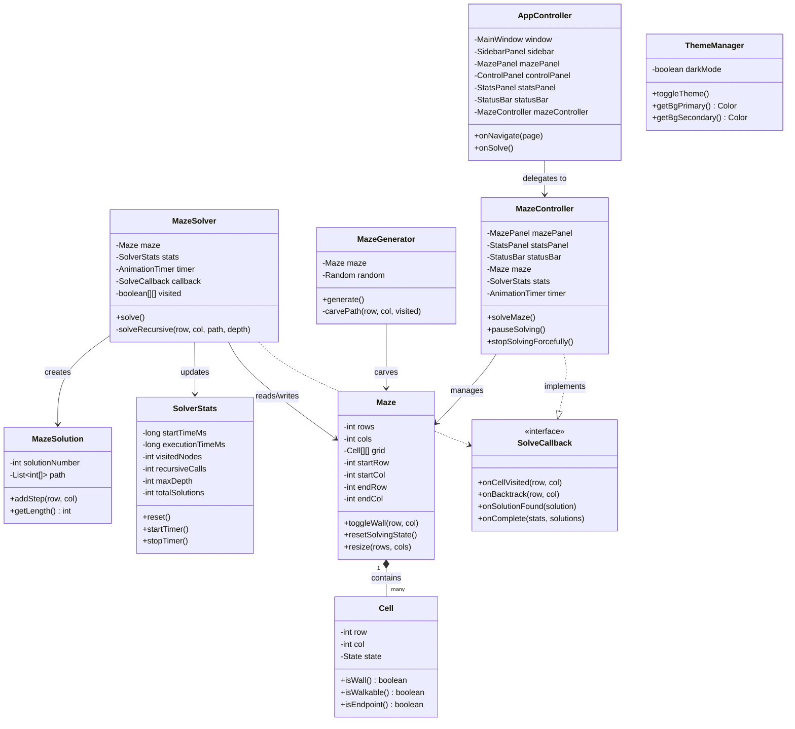

# 📊 UML Class Diagram & Algorithm Flowcharts

This document provides system design diagrams, including a UML class diagram and flowcharts for the solving and generation algorithms.

---

## 1. UML Class Diagram

Copy the Mermaid code below into any Mermaid renderer (like [mermaid.live](https://mermaid.live)) to display the interactive diagram.



---

## 2. Algorithm Flowcharts

### 2.1 DFS + Backtracking Solver Flowchart

```mermaid
graph TD
    Start([Start solverThread]) --> Init[Initialize visited array & reset stats]
    Init --> Call[Call solveRecursive(startRow, startCol)]
    
    %% Recursive Function
    Call --> GuardCheck{Is Cell out of bounds, WALL, or already visited?}
    GuardCheck -- Yes --> Backtrack[Return / Backtrack]
    GuardCheck -- No --> Mark[Mark Cell visited & update stats]
    
    Mark --> UIUpdate[Notify UI: Visited Blue]
    UIUpdate --> SpeedDelay[Sleep for speed delay]
    
    SpeedDelay --> EndCheck{Is Cell END?}
    EndCheck -- Yes --> SaveSol[Save Solution & Highlight Green]
    SaveSol --> ExploreRemaining[Backtrack to explore remaining directions]
    
    EndCheck -- No --> LoopDirs[Loop 4 directions: Down, Right, Up, Left]
    LoopDirs --> Recurse[Recurse: Call solveRecursive on neighbor]
    
    Recurse --> LoopDirs
    LoopDirs -- All directions checked --> Unmark[Unmark visited & Remove from path]
    Unmark --> UIBacktrack[Notify UI: Backtrack Orange]
    UIBacktrack --> Return[Return]
    
    ExploreRemaining --> Unmark
    Return --> End([Complete & Highlight Shortest Path])
```

### 2.2 Maze Generation (Recursive Backtracker) Flowchart

```mermaid
graph TD
    Start([Start Generation]) --> Fill[Fill entire grid with WALLS]
    Fill --> Call[Call carvePath(0, 0)]
    
    Call --> Mark[Mark current cell as OPEN & visited]
    Mark --> Neighbors{Are there unvisited neighbors 2 steps away?}
    
    Neighbors -- Yes --> Choose[Choose random unvisited neighbor]
    Choose --> Carve[Carve passage: Set neighbor and intermediate cell to OPEN]
    Carve --> Recurse[Recurse: Call carvePath on neighbor]
    Recurse --> Neighbors
    
    Neighbors -- No --> Backtrack[Return / Backtrack]
    Backtrack --> End([End Generation: Add random loop openings])
```
